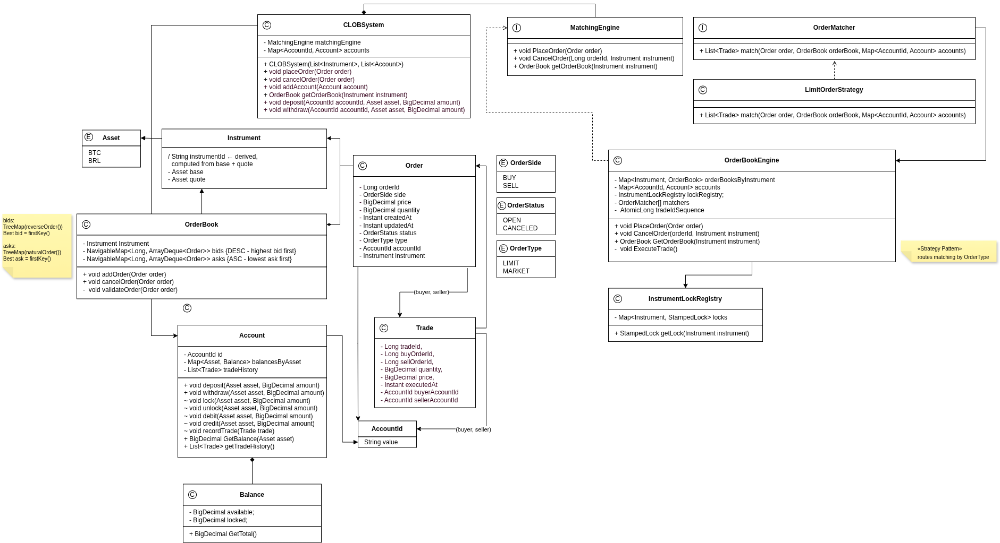

# CLOB System

## Overview

This project implements a high-performance **Central Limit Order Book (CLOB)** in Java, focused on low latency, deterministic execution, and high throughput.
It includes a separate module for load testing to simulate real-world trading conditions.

---

## Core Components



* **OrderBook**
  Maintains bid and ask sides using price-time priority.

* **MatchingEngine**
  Processes orders using a Strategy pattern to support different order types.

* **Account**
  Manages balances with locking, debiting, and settlement during trade execution.

* **Concurrency Model**
  Uses `StampedLock` to ensure thread safety with minimal contention.

---

## Build and Run

From the project root:

```bash
mvn clean install
```

Run the core system or load test module using the generated artifacts.

---

## Load Test Module

* Module: `clob-load-test`
* Simulates high-volume concurrent order flow
* Configurable load profile (threads, rate, duration)
* Measures:

    * throughput (orders/sec)
    * latency (average, p95, p99)
    * execution rate

Used to validate system behavior under stress and concurrency.

---

## AI Usage

This project was developed using AI-assisted techniques following the **4D AI Fluency Framework**.

* AI was used for:

    * boilerplate code generation
    * structural design alignment with UML
    * enforcing technical constraints

* The final architecture and decisions remain manually validated to ensure correctness and performance.
