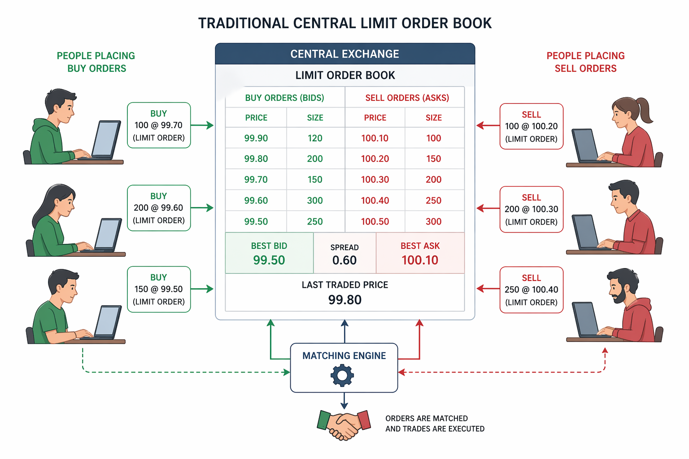

# Related Documentation

For details on load testing, see the [CLOB Load Test README](../clob-load-test/README.md).
# CLOB System — Central Limit Order Book



High-performance CLOB implementation in pure Java 21, focused on low latency, deterministic behavior, and high-concurrency throughput.

---

## Architecture

### Core Components

| Component | Description |
|---|---|
| `ClobSystem` | Public facade; single entry point for all operations |
| `OrderBookEngine` | `MatchingEngine` implementation; owns per-instrument `StampedLock` lifecycle |
| `LimitOrderStrategy` | `OrderMatcher` implementation; price-time priority matching via Strategy Pattern |
| `OrderBook` | Per-instrument bid/ask structure (`NavigableMap<Long, ArrayDeque<Order>>`) |
| `InstrumentLockRegistry` | Lazily creates and holds one `StampedLock` per instrument |
| `Order` | Cache-line padded domain object with `VarHandle` CAS updates for hot fields |
| `Account` | Multi-asset balance holder; mutation methods guarded by write lock |

### Concurrency Model

- Per-instrument `StampedLock`: write lock on `placeOrder`/`cancelOrder`, optimistic read with fallback on `getOrderBook`
- `VarHandle` CAS for `Order` volatile fields (`status`, `quantity`, `updatedAt`) — no `synchronized` blocks
- Cache-line padding hierarchy (`OrderLeadPad → OrderHotFields → OrderTrailPad`) to prevent false sharing

### Fixed-Point Arithmetic

Prices and quantities are stored as `long` primitives on the matching hot path:
- Price: integer BRL (`PRICE_DECIMALS = 0`)
- Quantity: satoshis (`QUANTITY_DECIMALS = 8`, scale = 100,000,000)

`BigDecimal` is used only at API boundaries (order creation, balance settlement).

---

## Operations

| Operation | Required | Method |
|---|---|---|
| Place limit order | ✅ | `ClobSystem.placeOrder(Order)` |
| Cancel order | ✅ | `ClobSystem.cancelOrder(Order)` |
| Deposit asset | ✅ | `ClobSystem.deposit(AccountId, Asset, BigDecimal)` |
| Withdraw asset | ✅ | `ClobSystem.withdraw(AccountId, Asset, BigDecimal)` |
| Get order book | ✅ | `ClobSystem.getOrderBook(Instrument)` |
| Get balance | ✅ | `Account.getAvailableBalance(Asset)` |

---

## Build & Run

**Requirements:** Java 21+, Maven 3.8+

```bash
# Build and run tests
mvn clean verify

# Build executable JAR
mvn clean package

# Run demo (Main.java)
java -jar target/clob-system-*.jar
```

Tests run with ZGC (`-XX:+UseZGC`) to simulate low-pause production conditions.

---

## Load Test Module

Located in `clob-load-test/` — simulates concurrent order flow against the CLOB system.

**Metrics collected:** throughput (orders/sec), average latency, P95, P99.

```bash
# From project root
./build-and-run.sh

# Or from clob-load-test/
./run.sh
```

Configure via `.env` (copy from `env-example.txt`). Key parameters: `THREAD_COUNT`, `ORDERS_PER_SECOND`, `TEST_DURATION_SECONDS`.

See `clob-load-test/README.md` for full configuration reference.

---

## AI-Assisted Development

This project was built using **Claude** (Anthropic) following the **4D AI Fluency Framework**:

- **Define** — architectural constraints and performance requirements were specified upfront (see `docs/01-CORE_AI_PROMPT.txt`)
- **Design** — UML class diagram (`docs/object-design.v.0.0.1.drawio`) provided structural intent before generation
- **Develop** — AI generated boilerplate, unit test scaffolding, and suggested the cache-line padding layout for `Order`
- **Deploy** — AI suggested ZGC configuration and checkstyle rules for code quality enforcement

**Patterns implemented with AI assistance:** Strategy Pattern (`OrderMatcher` per `OrderType`), Facade Pattern (`ClobSystem`), cache-line padding inheritance hierarchy.

**Architectural ownership was retained by the developer:** all design decisions, performance trade-offs, and concurrency contracts were defined before prompting.
